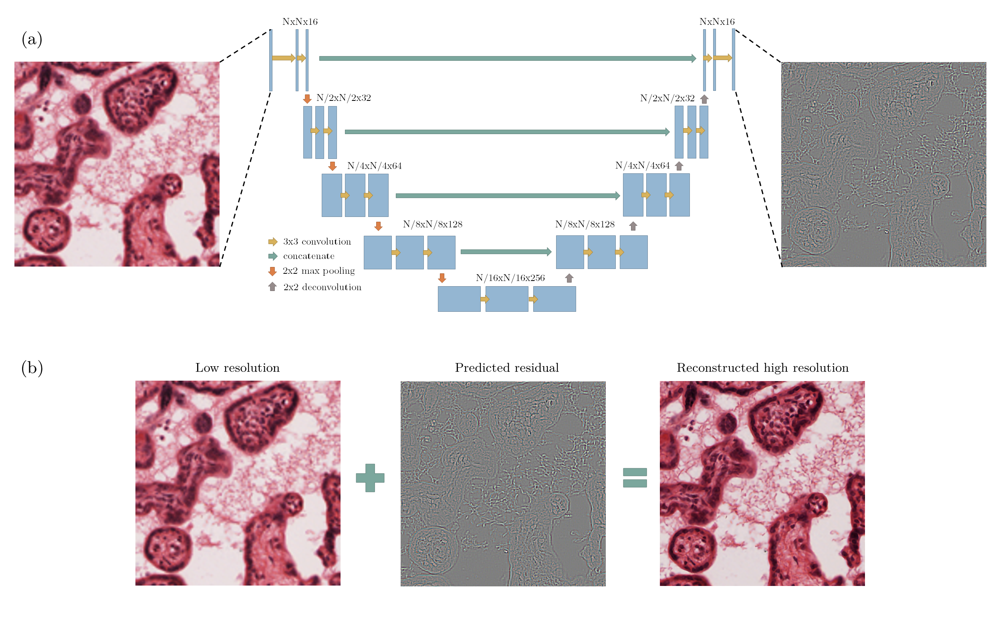
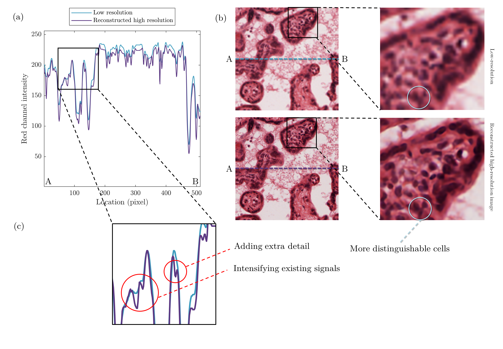

# PlacentaSR
## Resolution enhancement of placenta histological images using deep learning

In this repository, a method has been developed to improve the resolution of histological human placenta images. For this purpose, a paired series of high- and low-resolution images have been collected to train a deep neural network model that can predict image residuals required to improve the resolution of the input images. A modified version of the U-net neural network model has been tailored to find the relationship between the low resolution and residual images. After training for 900 epochs on an augmented dataset of 1000 images, the relative mean squared error of 0.003 is achieved for the prediction of 320 test images. The proposed method has not only improved the contrast of the low-resolution images at the edges of cells but added critical details and textures that mimic high-resolution images of placenta villous space. The availible dataset size is shrinked for practical reasons but the more complete version is sharable upon request. 

The deep learning model employed in this study is a tailored version of the U-net with 4 down-sampling and 4 up-sampling steps. At each step, two consecutive convolutions with the filter size of 3×3 and same-size padding are used with Exponential Linear Unit activation function and He Normal kernel initializer. Depth of the convoluted layers increases from 16 to 256 as multiplied by 2 in each of the down-sampling steps. In addition, a 2×2 max-pooling filter with the stride size of 2×2 is used to shrink the size of the image in each of the mentioned steps. 
Input and output images have the same dimensions of 512×512 pixels with 3 colour channels of red, green, and blue. The output image is designed to be the pixel-wise difference between the low- and high-resolution images. It is noteworthy that for practical convenience, the pixel values of the output residual image are shifted to be positive integers between 0 and 255, with the value of 127 representing no change and it is identified by grey colour. Accordingly, darker shades than the dominant grey denote a reduction in the average intensity of pixels and lighter shades represent a required increment of the pixel intensities. Figure above illustrates the structure of the deep learning model, input and output images, and a sample reconstruction of a high-resolution image by pixel-wise addition of the low-resolution image and the predicted residual. 

## An example result

Fig above represents a sample reconstruction of a high-resolution image based on a low-resolution input in addition to visualization of the red channel intensity variations. As it can be seen, when moving from point A to B on the graph, the red channel intensity of both images follows the same pattern, but with two differences. The reconstructed image has more intensified signals compared to the low-resolution image. In addition, some extra details have been added to the high-resolution image by the deep learning model that gives a better representation of the texture of the placenta villous space. In the reconstructed high-resolution image, cells are more distinguishable and consequently more suitable for pathological analysis if needed. 

## Some predictions

As another visual presentation, Figure above illustrates two examples of image resolution improvement based on two test images from two different healthy volunteers named cases #1 and #2. As it can be seen in both cases, image quality has improved to the level that the reconstructed high-resolution image is almost identical to the ground truth image based on a visual comparison. Also, the predicted residual is adequately similar to its ground truth. 
Based on the achieved resemblance between the images, the presented method in this study is suggested to be used prior to manual or machine-based analysis of placenta histological images, especially in the cases where image quality is a limitation. In our studied cases, the trained model can improve the image quality approximately from 20X magnification to 40X magnification. The method does not only sharpen the edges and intensified the weak signals but also creates local details and textures within the villous space as they exist in an original high-resolution image.

## How to run the code
This model is using Tensorflow and Keras for prediction of the high resolution images. This is the list of required packages to run the code: 
* numpy
* tensorflow
* keras
* urllib
* cv2
* h5py
* os
* sys

The first time you run the code, it asks you to download the training and test files. The data will be downloaded from Zenodo. In case it fails, this is the [Link](https://zenodo.org/record/6659509) to download manually. There are two variables at the begining of the Main.py named as "ReloadModel" and "TrainModel". You can change these varables as follow for different functionalities:

* Train from scratch: ReloadModel=0 ; TrainModel=1
* Train more: ReloadModel=1 ; TrainModel=1
* Just Predict: ReloadModel=1 ; TrainModel=0

## Citation
Arash Rabbani; Masoud Babaei, Resolution enhancement of placenta histological images using deep learning, Proceedings of the 4th International Conference on Statistics: Theory and Applications (ICSTA'22), Prague, Czech Republic – July 28- 30, 2022. 
